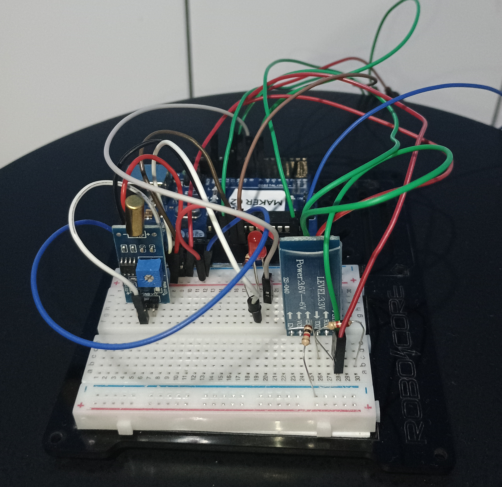
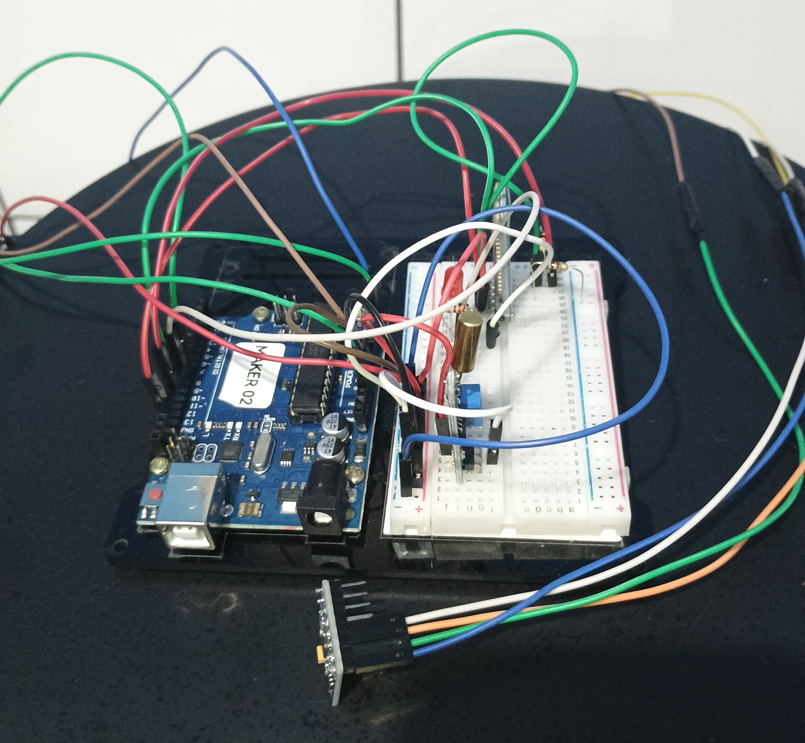
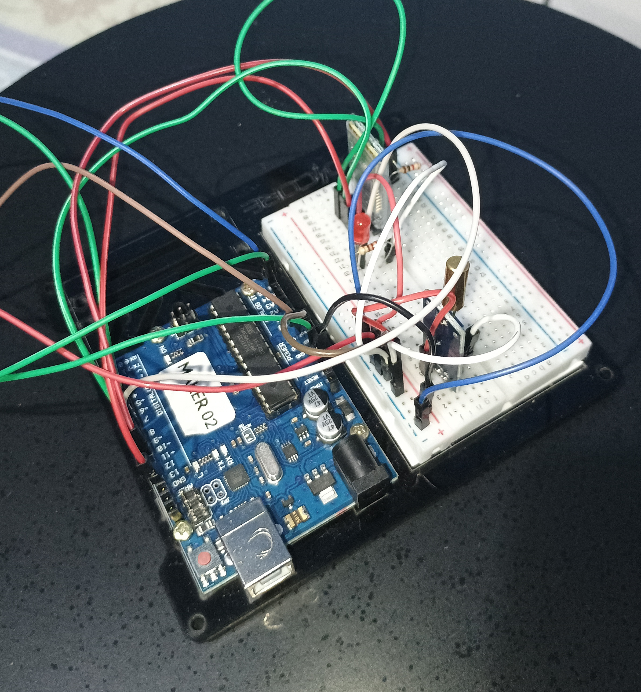

# SISTEMA DE MONITORAMENTO DE POSTURA COM ARDUINO

### Descrição 💡
Este projeto tem como objetivo desenvolver um sistema de monitoramento de postura utilizando um sensor de inclinação. O sistema alerta o usuário quando a postura está inadequada, promovendo hábitos de saúde e ergonomia.

### Tabela de Conteúdos 📋
- [Descrição](#descrição)
- [Componentes Utilizados](#componentes-utilizados)
- [Esquema de Circuitos](#esquema-de-circuitos)
- [Código Fonte](#codigo-fonte)
- [Execução do Projeto](#execucao-do-projeto)
- [Resultados](#resultados)
- [Possíveis Melhorias](#possiveis-melhorias)
- [Licensa](#licensa)
- [Conclusão](#conclusao)

### Componentes Utilizados 📦
- Arduino Uno
- Protoboard
- Jumpers
- Acelerometro
- Sensor de Inclinação
- Modúlo Bluetooth
- LED
- Buzzez

### Esquema de Circuitos ⚡

  
  
  
  

